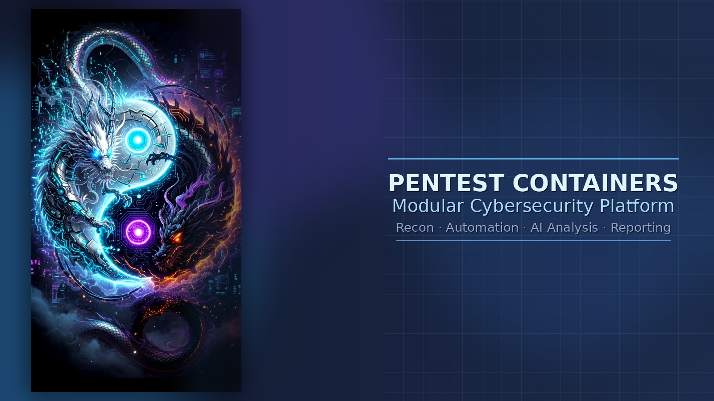
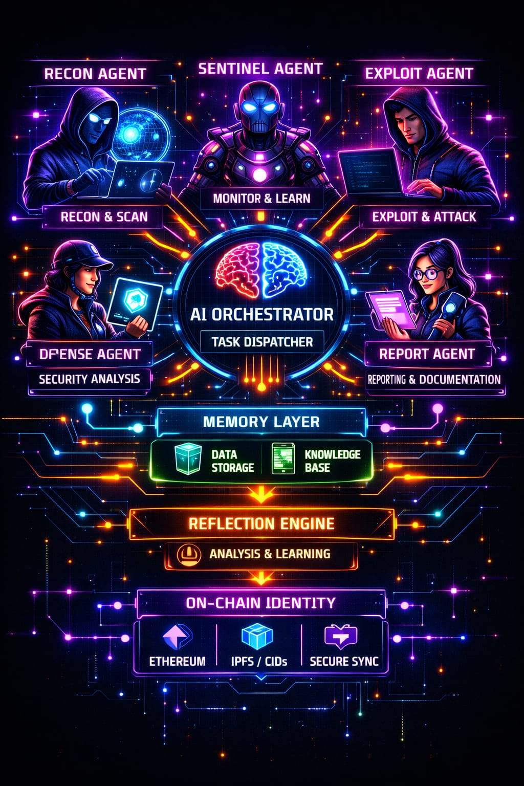
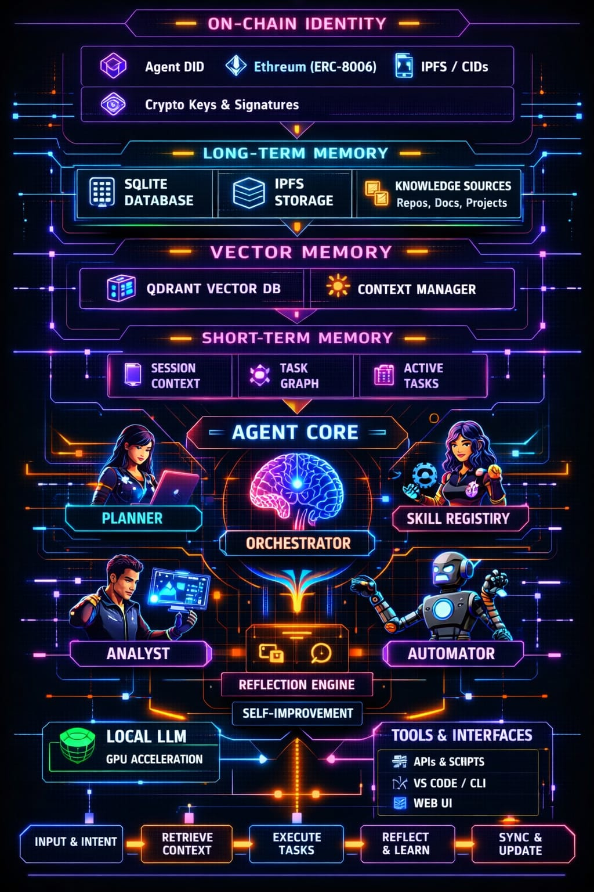
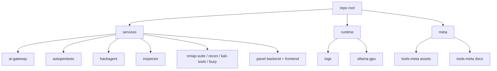

# Pentest Containers

<p align="center">
	
</p>

Modularny, konteneryzowany zestaw narzędzi pentestowych do rozpoznania, automatyzacji i inspekcji.

Ten projekt jest zbudowany jako zbiór niezależnych kontenerów, które można uruchamiać osobno lub razem przez `docker compose`. Każdy moduł ma własny katalog, Dockerfile oraz lokalny kod źródłowy, aby zapewnić skalowalność i szybki rozwój.

> Cel: jedno środowisko do workflow pentestowego end-to-end: rozpoznanie -> skanowanie -> analiza -> raportowanie.

## Spis treści

- [Wizualizacja architektury](#wizualizacja-architektury)
- [Co znajduje się w repozytorium](#co-znajduje-się-w-repozytorium)
- [Szybki start](#szybki-start)
- [Pierwsze 15 minut](#pierwsze-15-minut)
- [Usługi i moduły](#usługi-i-moduły)
- [Przykładowe komendy](#przykładowe-komendy)
- [Rozwój projektu](#rozwój-projektu)
- [Licencja](#licencja)

## Wizualizacja architektury

Sekcja prezentuje widok high-level oraz przepływ operacyjny między modułami. Układ jest celowo uproszczony, aby szybko pokazać strukturę projektu bez nadmiaru detali.

### Executive View

- Platforma łączy narzędzia pentestowe, warstwę AI i panel operacyjny w jednym, modularnym stacku kontenerowym.
- Orkiestracja przez `docker compose` upraszcza uruchamianie, skalowanie i utrzymanie środowiska.
- Architektura wspiera scenariusze od rozpoznania po raportowanie i automatyzację działań.

### Architecture Overview



Opis:
Widok topologii systemu pokazuje relacje między kontenerami narzędziowymi, warstwą AI oraz panelem zarządzania. Diagram służy jako mapa komponentów i punkt wejścia dla onboardingu technicznego.

### Operational Flow



Opis:
Widok przepływu operacyjnego prezentuje kolejność działań i wymianę danych między modułami. Ułatwia zrozumienie procesu od uruchomienia narzędzi, przez analizę, do generowania wyników i raportów.

### Architecture At A Glance

- **Model wdrożenia:** modularny stack kontenerowy uruchamiany przez `docker compose`
- **Warstwa AI:** `ollama-gpu` + `ai-gateway` + `panel/backend`
- **Warstwa operacyjna:** `nmap-suite`, `recon`, `kali-tools`, `inspector`, `autopentestx`, `hackagent`
- **Warstwa prezentacji:** `panel/frontend` (SvelteKit)
- **Telemetria i artefakty:** centralny katalog `logs/`

## Co znajduje się w repozytorium

- `docker-compose.yml` — główny orchestrator wszystkich usług
- `nmap-suite/` — kontener z narzędziami do skanowania sieci
- `recon/` — kontener z narzędziami do rozpoznania powierzchni ataku
- `hackagent/` — kontener HackAgent AI/automation
- `autopentestx/` — kontener AutoPentestX
- `inspector/` — kontener Inspector
- `ollama-gpu/` — lokalny katalog stanu Ollama i konfiguracja GPU
- `ai-gateway/` — FastAPI wrapper dla lokalnego serwera Ollama i modeli AI
- `panel/backend/` — backend FastAPI dla panelu sterowania, logów i integracji AI
- `panel/frontend/` — SvelteKit frontend do obsługi panelu sterowania
- `kali-tools/` — kontener z narzędziami Kali
- `burp/` — opcjonalny kontener Burp Suite
- `logs/` — centralny katalog logów i raportów asystenta
- `tools-meta/docs/` — uporządkowana dokumentacja projektu i operacji
- `LICENSE` — licencja open-source MIT
- `tools-meta/docs/project/ROADMAP.md` — plan dalszego rozwoju projektu

## Struktura Repo (Quick View)



## Cel projektu

To repozytorium ma być profesjonalnym fundamentem środowiska pentestowego:

- modularne kontenery narzędziowe
- centralne zarządzanie przez `docker compose`
- możliwości integracji z AI i lokalnym modelem Ollama
- ścieżka rozwoju w kierunku panelu sterowania, API i raportowania

## Wymagania

- Docker Engine 20.10+ (Linux zalecany)
- Docker Compose v2 / `docker compose`
- NVIDIA Container Toolkit, jeżeli chcesz uruchomić `ollama-gpu`
- Opcjonalnie: `DOCKER_API_VERSION=1.44`, gdy klient Docker ma starsze API niż serwer

## Szybki start

Wersja skrócona dla szybkiego wejścia:

1. Zbuduj obrazy:

```bash
docker compose build
```

2. Uruchom bazowy stack:

```bash
docker compose up -d nmap_suite recon panel
```

3. Zweryfikuj, że usługi działają:

```bash
docker compose ps
```

Po starcie przejdź do sekcji **Pierwsze 15 minut** dla pierwszego testu i walidacji.

Jeśli napotkasz błąd API klienta:

```bash
DOCKER_API_VERSION=1.44 docker compose up -d nmap_suite
```

## Pierwsze 15 minut

Nowa osoba w projekcie może zacząć od tych 3 kroków:

1. **Uruchom stack bazowy**

```bash
docker compose build
docker compose up -d nmap_suite recon panel
```

2. **Zweryfikuj status usług**

```bash
docker compose ps
docker logs panel-backend --tail 80
```

3. **Uruchom pierwszy skan testowy**

```bash
docker exec -it recon bash
subfinder -d example.com
```

## Usługi i moduły

### `nmap_suite`

Narzędzia do skanowania sieci i hostów. Domyślnie uruchamiany w katalogu `/tools`.

### `recon`

Narzędzia do rozpoznania domeny i infrastruktury. W pakiecie znajdują się m.in. `subfinder` oraz `amass`.

### `hackagent`

Lokalny kontener HackAgent z kodem źródłowym do szybkiego developmentu i testowania CLI.

### `autopentestx`

Kontener AutoPentestX z zależnościami zdefiniowanymi w `autopentestx/requirements.txt`.

### `inspector`

Kontener do inspekcji i analizy, uruchamiający skrypty Python z katalogu `inspector/core`.

### `ollama`

Lokalny serwer Ollama z obsługą GPU. Przechowuje stan w katalogu `ollama-gpu`.

### `panel`

Backend AI dla panelu sterowania, który łączy się z lokalnym Ollama i oferuje endpointy do generowania raportów, PoC, analizy logów i kodu.

### `kali`

Kontener z narzędziami Kali do zadań zaawansowanych.

### `burp`

Opcjonalny kontener Burp Suite, przeznaczony do integracji z resztą środowiska.

## Przykładowe komendy

Uruchomienie kontenera `recon`:

```bash
docker compose build recon
```

```bash
docker compose up -d recon
```

Test w kontenerze `recon`:

```bash
docker exec -it recon bash
subfinder -d example.com
amass enum -d example.com
```

Sprawdzenie `hackagent`:

```bash
docker exec -it hackagent bash
python3 -c "import hackagent; print('hackagent ok')"
hackagent --help
```

Sprawdzenie `autopentestx`:

```bash
docker exec -it autopentestx bash
python3 /app/main.py --version
```

Sprawdzenie `inspector`:

```bash
docker exec -it inspector bash
python3 /app/core/inspector.py -h
```

## Rozwój projektu

Zobacz `tools-meta/docs/project/ROADMAP.md` po szczegóły dotyczące kolejnych etapów rozwoju projektu.

## Aktualny stan katalogu głównego (2026-07-19)

Aktualna struktura katalogu głównego obejmuje:

- `ai-gateway/`
- `autopentestx/`
- `burp/`
- `hackagent/`
- `inspector/`
- `kali-tools/`
- `logs/`
- `nmap-suite/`
- `ollama-gpu/` (lokalny stan runtime, domyślnie poza kontrolą wersji)
- `panel/` (`backend/` + `frontend/`)
- `recon/`
- `tools-meta/` (`assets/` + `docs/`)

<details>
<summary>Katalogi deweloperskie lokalne (nieprodukcyjne)</summary>

- `.tmpvenv/` (lokalne venv narzędziowe)
- `.vscode/` (ustawienia edytora)

</details>

Pliki główne:

- `docker-compose.yml`
- `README.md`
- `tools-meta/docs/README.md`
- `tools-meta/docs/project/ROADMAP.md`
- `tools-meta/docs/operations/LOGS.md`
- `LICENSE`

## Licencja

Projekt jest dostępny na licencji MIT. Zobacz `LICENSE`.
